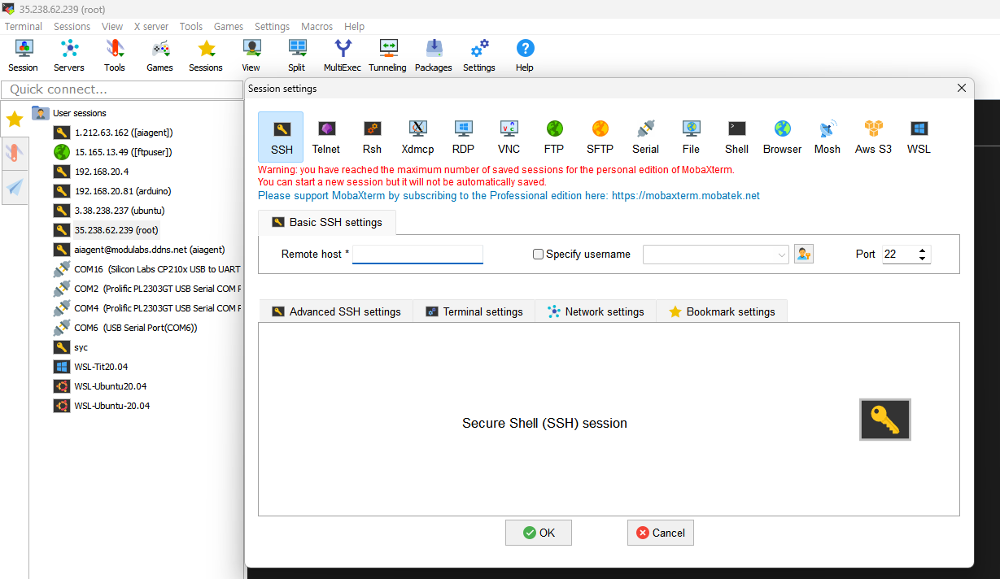
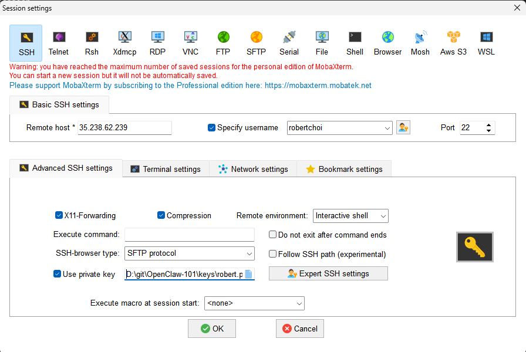
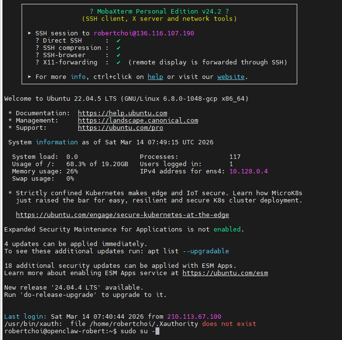
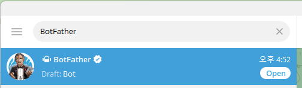
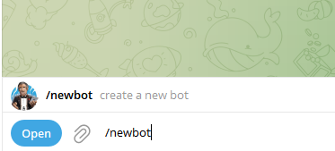
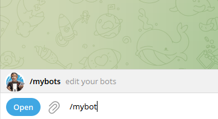
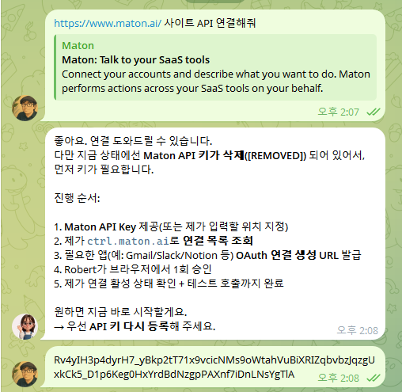
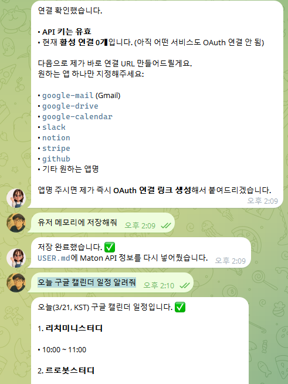

> **대상:** OpenClaw School 1차시 수강생
> **분량:** 하루 20~30분
> **전제:** 강사가 제공한 **GCP 서버**(또는 본인 PC)에 오픈클로를 설치합니다. 앞의 이틀은 터미널에서 직접 손을 쓰고, **3일차부터는 메신저 채팅으로 에이전트에게 지시**합니다.
> **목표:** 6일 뒤, 내 휴대폰 메신저에서 말을 걸면 **검색하고, 일정을 잡고, 기록까지 남기는** AI 비서 한 명을 갖는다.

## 시작하기 전에: 챗봇이 아니라 비서를 만든다

ChatGPT에게 "이메일 초안 써줘"라고 하면 **텍스트가 나옵니다.** 오픈클로 비서에게 "이메일 보내줘"라고 하면 **실제로 발송됩니다.** 이 차이가 6일 미션의 전부입니다.

| 구분 | 챗봇 (예: ChatGPT) | AI 에이전트 (예: OpenClaw) |
| :-- | :-- | :-- |
| **하는 일** | 질문에 답변 | 질문에 답변 + 직접 작업 수행 |
| **예시** | "이메일 초안 써줘" → 텍스트 출력 | "이메일 보내줘" → 실제로 전송 |
| **특징** | 사람이 복사·붙여넣기 해야 함 | 에이전트가 알아서 실행 |

그래서 비서에게는 **몸(서버)·두뇌(AI 모델)·입(메신저)·손발(외부 서비스 연동)**이 차례로 필요합니다. 6일 로드맵은 정확히 그 순서입니다.

| 역할 | 담당 | 하는 일 |
| :-- | :-- | :-- |
| **나 (사용자)** | 환경 구축과 판단 | Day 1~2 설치·설정, 어떤 비서를 만들지 결정 |
| **오픈클로 (비서)** | 실행 | Day 3부터 검색·연동·기록을 대신 수행 |

> **💡 이렇게 읽으세요:** Day 1~2는 터미널에 명령어를 **직접 입력**합니다. Day 3부터는 코드블록이 **에이전트에게 보내는 채팅 메시지**로 바뀝니다. 어느 쪽인지는 각 미션에 표시해 두었습니다.

### 준비물

| 준비물 | 설명 | 준비 방법 |
| :-- | :-- | :-- |
| **GitHub 계정** | 에이전트 프로젝트를 저장·관리할 공간 | [github.com](https://github.com) 무료 가입 |
| **OpenClaw 실행 환경** | 에이전트를 실행할 서버 | 강사 제공 GCP 인스턴스 또는 로컬 PC |
| **Maton API 정보** | 외부 서비스 연동용 API | 수업 시간에 안내 |
| **스마트폰** | Telegram으로 비서와 대화 | Telegram 앱 설치 |

## 6일 로드맵 한눈에 보기

| Day | 오늘 배우는 것 | 미션 결과물 |
| :-- | :-- | :-- |
| **1** | 서버 접속과 설치 — 비서의 '몸' 만들기 | 데몬으로 상시 실행되는 오픈클로 |
| **2** | OpenRouter — 비서의 '두뇌' 연결하기 | API 키 등록 + 무료 모델 응답 확인 |
| **3** | Telegram & 웹 검색 — 비서의 '입과 눈' | 휴대폰에서 대화 + 최신 정보 검색 |
| **4** | Maton API — 비서의 '손발' 달기 | 구글 캘린더 조회·등록 성공 |
| **5** | ClawHub & 보안 — 능력 확장과 안전장치 | 스킬 1개 + `openclaw doctor` 통과 |
| **6** | GitHub & 표준 포맷 — 기록과 기획 | 저장소 + 나의 에이전트 소개서 |

---

## Day 1 — 서버 접속과 설치: 비서의 '몸' 만들기

### 오늘의 개념

비서에게는 **24시간 켜져 있는 몸**이 필요합니다. 내 노트북은 덮으면 꺼지지만, 서버는 잠들지 않습니다. 오늘은 서버에 접속해 오픈클로를 올리고, **데몬(daemon)**으로 등록해 서버가 재부팅돼도 자동으로 깨어나게 만듭니다.

| 구성 요소 | 역할 | 쉬운 비유 |
| :-- | :-- | :-- |
| **Gateway** | 외부 메시지(Telegram, Discord 등)를 받아 전달 | 회사의 안내 데스크 |
| **Agent Core** | 실제로 생각하고 판단하는 두뇌 | 직원의 머리 |
| **Browser Relay** | 웹 브라우저를 조작하게 해주는 연결 장치 | 에이전트의 손 |

이 3대 구조를 알아두면 나중에 문제가 생겼을 때 **어디를 봐야 할지** 알 수 있습니다. 메시지가 안 오면 Gateway, 답이 이상하면 Agent Core, 웹 작업이 실패하면 Browser Relay입니다.

### 미션 (20~30분) — 터미널에서 직접

1. **MobaXterm을 설치**합니다. [공식 사이트](https://mobaxterm.mobatek.net/download.html)에서 **Home Edition (Installer edition)**을 받습니다. (Windows 기준)
2. **Session ➡️ SSH**를 클릭하고, 강사가 제공한 IP와 사용자명을 입력합니다.

   

3. **Advanced SSH settings** 탭에서 **Use private key**를 체크하고 `key.pem` 파일을 선택한 뒤 접속합니다.

   

   

   > **Mac 사용자:** 별도 프로그램 없이 기본 터미널에서 `ssh -i key.pem user@[서버IP]` 로 접속합니다.

4. 오픈클로를 설치합니다.
   ```bash
   curl -fsSL https://openclaw.ai/install.sh | bash
   ```
5. 온보딩 마법사를 실행해 **데몬으로 등록**합니다. 화면 안내에 따라 진행합니다.
   ```bash
   openclaw onboard --install-daemon
   ```
6. 정말 살아 있는지 확인합니다.
   ```bash
   openclaw gateway status
   ```

> **💡 TIP:** 설치가 막히면 대부분 **Node.js 버전**(v18 이상 필요, v22 LTS 권장) 아니면 **권한** 문제입니다. 에러 메시지 전체를 복사해 두세요 — Day 3에서 비서에게 그대로 물어볼 수 있습니다.

### 완료 체크리스트

- [ ] SSH로 서버 접속 성공
- [ ] `install.sh` 설치 완료
- [ ] `openclaw onboard --install-daemon` 실행
- [ ] Gateway 상태 확인 (실행 중)

---

## Day 2 — OpenRouter: 비서의 '두뇌' 연결하기

### 오늘의 개념

어제 만든 것은 **몸**입니다. 아직 생각을 못 합니다. **OpenRouter**는 전 세계 AI 모델(GPT, Claude, Llama 등)을 **하나의 API로** 쓰게 해주는 통합 플랫폼입니다.

```text
에이전트 ──(OpenRouter API)──▶ GPT / Claude / Llama 등 다양한 AI 모델
```

**비유하자면 인재 파견소입니다.** 일이 가벼우면 저렴한 모델, 어려우면 똑똑한 모델 — 상황에 맞게 두뇌를 갈아 끼웁니다.

| 특징 | 개별 API 연동 | OpenRouter |
| :-- | :-- | :-- |
| **비용** | 서비스마다 따로 결제·관리 | 한 곳 충전으로 여러 모델 사용 |
| **코드 수정** | 모델마다 연결 방식 변경 | 모델 이름만 바꾸면 교체 |
| **다양성** | 특정 회사 모델에 종속 | 수백 개 무료/유료 모델 |

### 미션 (20~30분) — 터미널에서 직접

1. [openrouter.ai](https://openrouter.ai)에 접속해 GitHub 또는 Google 계정으로 로그인합니다.
2. 메뉴에서 **Keys ➡️ Create Key**를 눌러 API 키를 발급하고, **안전한 곳에 즉시 복사해 둡니다.** (화면을 벗어나면 다시 볼 수 없습니다.)
3. 모델 설정 화면을 엽니다.
   ```bash
   openclaw configure --section model
   ```
4. 안내에 따라 OpenRouter API 키를 입력하고, **무료 모델부터** 추가합니다. 목록에서 `Free` 표기를 찾으세요.

   

5. **설정을 바꿨으면 반드시 Gateway를 재시작합니다.** 이걸 빼먹으면 변경이 반영되지 않습니다.
   ```bash
   openclaw gateway restart
   ```
6. 두뇌가 붙었는지 터미널에서 바로 확인합니다.
   ```bash
   openclaw
   ```
   대화창이 열리면 아무 질문이나 던져 응답이 오는지 봅니다.

> **💡 TIP:** 처음 실습은 무료 모델(`...:free` 표기)로 충분합니다. 무료 모델은 응답이 느리거나 가끔 실패하는데, 이는 **내 설정 문제가 아니라 모델 혼잡** 때문인 경우가 많습니다. 유료 모델도 하나 등록해 두고 비교해 보세요.

### 완료 체크리스트

- [ ] OpenRouter 가입 및 API 키 발급
- [ ] `configure --section model`로 키 등록
- [ ] 무료 모델 1개 이상 추가
- [ ] `gateway restart` 실행
- [ ] 터미널에서 첫 응답 확인

---

## Day 3 — Telegram & 웹 검색: 비서의 '입과 눈' 열어주기

### 오늘의 개념

비서가 서버 안에만 있으면 쓸 일이 없습니다. **오늘부터 비서는 내 휴대폰으로 들어옵니다.** 그리고 웹 검색을 붙이면, 학습 데이터에 없는 **오늘 일어난 일**까지 답할 수 있게 됩니다.

```text
휴대폰 Telegram 메시지 전송
  → Gateway가 수신
    → Agent Core가 분석·판단
      → 필요하면 웹 검색 / 브라우저 작업
        → 결과를 메신저로 응답
```

**오늘이 분기점입니다.** 지금까지는 터미널에 명령어를 쳤지만, 이제부터는 **말을 걸면 됩니다.**

### 미션 (20~30분) — 터미널 설정 후 채팅으로 전환

1. Telegram 앱에서 **@BotFather**를 찾아 대화를 시작합니다.

   

2. `/newbot` 명령으로 봇을 만들고, 이름과 사용자명을 정합니다. 마지막에 나오는 **Bot Token**을 복사합니다.

   

3. 서버 터미널에서 채널 설정을 엽니다.
   ```bash
   openclaw configure --section channels
   ```
   `telegram`을 선택하고 방금 복사한 토큰을 입력합니다.

   

4. Gateway를 재시작한 뒤, **휴대폰에서 내 봇에게 첫 인사를 보냅니다.**
   ```bash
   openclaw gateway restart
   ```

   

5. 웹 검색을 붙입니다.
   ```bash
   openclaw configure --section web
   ```
   `BraveSearch`를 선택하고 API 키를 입력한 뒤, 다시 `openclaw gateway restart`.
6. **이제부터는 채팅으로 지시합니다.** 검색이 붙었는지 확인합니다.
   ```
   오늘 AI 에이전트 관련 최신 뉴스 3개를 찾아서 한 줄씩 요약해줘
   ```
7. Day 1에서 막혔던 부분이 있었다면, 이제 비서에게 물어봅니다.
   ```
   내가 어제 설치할 때 이런 에러가 났어: (에러 메시지 붙여넣기)
   원인이 뭐고 어떻게 해결하면 되는지 알려줘
   ```

> **💡 TIP:** 설정을 바꿨는데 반응이 없다면 십중팔구 **Gateway 재시작을 안 한 것**입니다. `openclaw gateway restart`는 6일 내내 가장 많이 치게 될 명령어이니 지금 외워 두세요.

### 완료 체크리스트

- [ ] BotFather로 Telegram 봇 생성
- [ ] `configure --section channels`로 토큰 등록
- [ ] 휴대폰에서 비서와 첫 대화 성공
- [ ] Brave Search 연결 + 재시작
- [ ] 검색이 필요한 질문에 최신 정보로 응답 확인

---

## Day 4 — Maton API: 비서의 '손발' 달기

### 오늘의 개념

말만 하는 비서는 아직 챗봇입니다. **Maton API**는 지메일·구글 캘린더 같은 외부 서비스를 복잡한 인증 코드 없이 연결해 주는 **만능 어댑터**입니다.

```text
❌ Maton 없이 지메일 연동:
   프로젝트 생성 → OAuth 설정 → API 활성화 → 인증 코드 50줄 → 전송 코드 30줄
   → 약 2~3시간 + 디버깅

✅ Maton으로 연동:
   대시보드에서 클릭 → Google 로그인 → 완료
   → 약 3분
```

| 연동 서비스 | 비서가 할 수 있는 일 | 활용 예시 |
| :-- | :-- | :-- |
| **Gmail** | 이메일 읽기·보내기·검색 | "오늘 온 중요 메일 요약해줘" |
| **Google Calendar** | 일정 조회·등록·수정 | "내일 오후 3시에 미팅 잡아줘" |
| **Google Sheets** | 데이터 읽기·쓰기 | "이번 달 매출 데이터 정리해줘" |
| **Slack / Discord** | 메시지 전송·알림 | "팀 채널에 주간 보고 보내줘" |

### 미션 (20~30분) — 채팅으로 지시

1. [maton.ai](https://maton.ai)에 가입하고 **API 키**를 확인합니다.
2. 대시보드에서 **서비스 연동 ➡️ Google Calendar**를 선택하고, Google 계정 로그인·권한 허용까지 마칩니다.
3. 비서에게 서비스를 파악시킵니다.
   ```
   https://www.maton.ai/ 사이트 API 연결해줘
   ```
4. API 키를 전달합니다.
   ```
   Rv4yIH3...
   ```

   

5. 다음에 또 묻지 않도록 **기억시킵니다.** 오픈클로의 영구 기억 기능입니다.
   ```
   유저 메모리에 저장해줘
   ```
6. **눈에 보이는 결과로 검증합니다.** 순서대로 시켜 보세요.
   ```
   오늘 구글 캘린더 일정 알려줘
   ```
   ```
   3월 15일 오후 2시에 '오픈클로스쿨 3차시' 일정 추가해줘
   ```
   ```
   이번 주 비어있는 시간 찾아줘
   ```

   

7. 실제로 **구글 캘린더 앱을 열어** 일정이 들어갔는지 두 눈으로 확인합니다. 이것이 오늘 미션의 진짜 완료 조건입니다.

> **💡 TIP:** 첫 연동은 반드시 **구글 캘린더**로 시작하세요. 결과가 화면에 즉시 보이니 성공·실패 판단이 명확합니다. 메일 발송처럼 **되돌릴 수 없는 작업**은 캘린더가 확실히 동작한 뒤에 시도하세요.

### 완료 체크리스트

- [ ] Maton 가입 및 API 키 확인
- [ ] Google Calendar 연동 완료
- [ ] 비서에게 API 키 전달 + 유저 메모리 저장
- [ ] 캘린더 조회·등록·빈 시간 찾기 3종 성공
- [ ] 구글 캘린더 앱에서 실제 반영 확인

---

## Day 5 — ClawHub & 보안: 능력 확장과 안전장치

### 오늘의 개념

**ClawHub**는 전 세계 커뮤니티가 만든 수천 개의 스킬을 공유하는 마켓플레이스입니다. 스킬은 `SKILL.md`(마크다운 지시서) + 메타데이터로 된 패키지이고, 설치하면 비서에게 새 능력이 생깁니다. **비서가 스스로 스킬을 작성하는 것도 가능합니다.**

| 순위 | 스킬 카테고리 | 예시 |
| :--: | :-- | :-- |
| 1 | 웹 브라우징 | 웹 검색, 데이터 스크래핑 |
| 2 | Telegram 통합 | 봇 자동 응답, 그룹 관리 |
| 3 | 이메일 관리 | Gmail 읽기/발송/요약 |
| 4 | 데이터베이스 쿼리 | SQL 실행, 데이터 분석 |
| 5 | 비즈니스 자동화 | CRM 연동, 보고서 생성 |

그런데 **강력한 만큼 위험합니다.** 오픈클로는 파일·터미널·브라우저에 접근할 수 있고, ClawHub에서 악성 스킬이 230건 이상 발견된 적도 있습니다. 그래서 오늘은 능력 확장과 안전장치를 **같이** 다룹니다.

| 위험 요소 | 설명 |
| :-- | :-- |
| 악성 스킬 | 악의적인 스킬이 마켓에 올라올 수 있음 |
| 시스템 접근 | 에이전트가 파일·브라우저·터미널에 접근 가능 |
| API 키 노출 | 설정 파일에 키가 평문 저장될 수 있음 |

**안전하게 쓰는 5가지 규칙**

```
✅ 1. 중요 데이터가 없는 별도 서버/VM에서 실행
✅ 2. openclaw doctor 보안 감사 명령 정기 실행
✅ 3. 서드파티 스킬 설치 전 코드 직접 검토
✅ 4. 비특권 계정(non-root)으로 실행
✅ 5. 외부 포트 노출 최소화
```

### 미션 (20~30분) — 채팅으로 지시

1. 내 분야에 맞는 스킬을 찾게 합니다.
   ```
   ClawHub에서 내 관심 분야(OO)에 쓸 만한 스킬 5개를 찾아서,
   각각 뭘 하는 스킬이고 어떤 권한이 필요한지 표로 정리해줘
   ```
2. 하나를 고르되, **설치 전에 내용을 먼저 확인합니다.** 규칙 3번의 실천입니다.
   ```
   (스킬 이름)의 SKILL.md 내용을 보여주고,
   위험해 보이는 동작이 있는지 검토해서 알려줘
   ```
3. 문제없다고 판단되면 설치하고 실제로 써 봅니다.
   ```
   (스킬 이름) 설치하고, 한 번 실행해서 결과 보여줘
   ```
4. 보안 감사를 돌립니다.
   ```
   openclaw doctor 실행해서 결과를 알기 쉽게 설명해줘.
   경고가 있으면 위험도 순으로 정리하고 해결 방법도 알려줘
   ```
5. 경고가 나왔다면 **하나만 골라 즉시 해결**합니다.
   ```
   위 경고 중 가장 위험한 것 하나를 지금 고쳐줘. 뭘 바꿀 건지 먼저 설명해줘
   ```

> **📌 참고:** 오픈클로는 2026년 2월 VirusTotal과 파트너십을 맺어 ClawHub 등록 스킬에 보안 스캔을 적용하고 있습니다. 다만 국내 주요 IT 기업들은 사내망 사용을 제한하고 있으니, 학습은 **격리된 환경(GCP 인스턴스 등)**에서 하세요.

### 완료 체크리스트

- [ ] ClawHub 스킬 후보 5개 조사
- [ ] 설치 전 `SKILL.md` 내용 검토
- [ ] 스킬 1개 설치 + 실행 성공
- [ ] `openclaw doctor` 실행 및 결과 이해
- [ ] 경고 1건 이상 조치

---

## Day 6 — GitHub & 표준 포맷: 기록하고 기획하기

### 오늘의 개념

**에이전트도 결국 제품입니다.** 제품은 기록되고 버전 관리되어야 합니다. GitHub는 매 차시 결과물이 쌓이는 **포트폴리오**가 됩니다.

```
1차시 → 2차시 → 3차시 → 4차시
 ↓        ↓        ↓        ↓
설치     지식구축    개발    상품화
 └────────┴─────────┴────────┘
      매 차시마다 GitHub에 저장!
```

| 용어 | 뜻 | 쉬운 비유 |
| :-- | :-- | :-- |
| **Repository** | 프로젝트 파일을 담는 폴더 | 프로젝트 바인더 |
| **Clone** | 원격 저장소를 내 컴퓨터로 복사 | 체인점 내기 |
| **Commit** | 변경 사항을 저장 | "저장" 버튼 |
| **Push** | 내 변경 사항을 GitHub에 올리기 | 클라우드 업로드 |
| **Pull** | GitHub의 최신 내용 가져오기 | 업데이트 다운로드 |
| **README.md** | 프로젝트의 얼굴이자 소개 문서 | 프로젝트 표지 |

그리고 2차시부터 계속 쓸 **AI 친화적 표준 포맷**을 오늘 미리 익힙니다. 비서에게 좋은 지식을 주려면 **구조가 정해진 문서**여야 합니다.

```markdown
# [Topic] 문서 제목 (핵심 키워드)

## Concept (개념)
- 이 지식이 무엇인지 한두 문장으로 명확히 정의합니다.

## Example (사례)
- 구체적인 실행 코드, 대화 예시, 데이터를 담습니다.

## Checklist (검증)
- [ ] 작업 시 반드시 확인해야 할 사항
- [ ] 완료 후 만족해야 할 조건
```

### 미션 (20~30분) — 채팅으로 지시

1. GitHub에 `my-agent` 저장소를 만듭니다. (이 단계만 웹에서 직접)
2. 비서에게 연결을 맡깁니다.
   ```
   내 GitHub 저장소 @유저명/my-agent 를 워크스페이스에 클론하고,
   앞으로 작업한 내용을 여기에 커밋해줘
   ```
3. **내가 만들고 싶은 전문가 에이전트 주제 3개**를 정합니다. 이건 비서가 대신 못 하는, 오늘의 진짜 과제입니다.
   ```
   내 분야는 OO이야. 이 분야에서 전문가 에이전트를 만든다면
   어떤 주제가 좋을지 5개 제안하고, 각각 누가 왜 쓸지 설명해줘
   ```
   → 제안을 참고하되 **최종 3개는 내가 고릅니다.**
4. 고른 주제 하나로 **표준 포맷 소개서**를 만들게 합니다. Example은 반드시 내 경험으로 채웁니다.
   ```
   'agent-intro.md'를 Topic-Concept-Example-Checklist 4단 구조로 만들어줘.
   주제는 (내가 고른 주제)이고, Example에는 다음 내 경험을 정리해서 넣어줘: (내 경험)
   ```
5. 결과를 **원본 마크다운으로 받아** 문법이 어떻게 쓰였는지 눈으로 확인합니다.
   ```
   agent-intro.md 원본 마크다운 그대로 보여줘
   ```
6. 저장소 얼굴을 만들고 푸시합니다.
   ```
   README.md에 이 저장소가 뭔지, 1차시에 뭘 했는지 정리해서 쓰고,
   전부 커밋해서 GitHub에 올려줘
   ```
7. **나만의 에이전트 한 줄 소개**를 직접 써서 README에 넣습니다.
   > 예시: "영어 문법 질문에 실시간으로 답하고, 오답 패턴을 분석해주는 1:1 영어 튜터"

> **💡 TIP:** 4번의 Example을 비서가 그럴듯하게 **지어내면 안 됩니다.** 2차시에서 이 문서들이 Knowledge Base가 되고, 3차시에서는 비서가 이 내용으로 손님에게 답합니다. 없는 사실이 섞이면 그때 문제가 터집니다. 지금부터 습관을 들이세요.

### 완료 체크리스트

- [ ] GitHub 저장소 생성 및 워크스페이스 연결
- [ ] 만들고 싶은 전문가 에이전트 주제 3개 확정
- [ ] Topic-Concept-Example-Checklist 소개서 1개 작성
- [ ] Example이 나의 실제 경험으로 채워짐
- [ ] README.md 작성 + 커밋·푸시 완료
- [ ] 나만의 에이전트 한 줄 소개 작성

---

## 6일을 마친 당신에게

6일 전에는 서버 접속 화면 하나 앞에 있었습니다. 지금은 **휴대폰에서 말을 걸면 검색하고, 일정을 잡고, 기록을 남기는 비서**가 24시간 돌아가고 있습니다.

하지만 이 비서는 아직 **아무거나 조금씩 아는 범용 AI**입니다. 진짜 경쟁력은 다음 단계에 있습니다.

> **핵심 인사이트:** 앞으로는 "AI를 잘 쓰는 사람"이 아니라, **"자기 분야의 전문가 에이전트를 만든 사람"**이 경쟁력을 가진다.

2차시에서는 Obsidian으로 **나만의 지식 금고**를 만들어, 이 비서를 내 분야의 전문가로 키웁니다. Day 6에서 정한 주제 3개가 그 출발점입니다.

> **한 줄 정리:** AI 에이전트 개발의 첫걸음은 환경 구축이며, OpenClaw + GitHub + API 연결이 그 출발점이다.

### 최종 확인표

| Day | 배운 것 | 완료 |
| :-- | :-- | :--: |
| 1 | 서버 접속·설치 — 비서의 몸 | ☐ |
| 2 | OpenRouter — 비서의 두뇌 | ☐ |
| 3 | Telegram·웹 검색 — 비서의 입과 눈 | ☐ |
| 4 | Maton API — 비서의 손발 | ☐ |
| 5 | ClawHub·보안 — 확장과 안전 | ☐ |
| 6 | GitHub·표준 포맷 — 기록과 기획 | ☐ |
