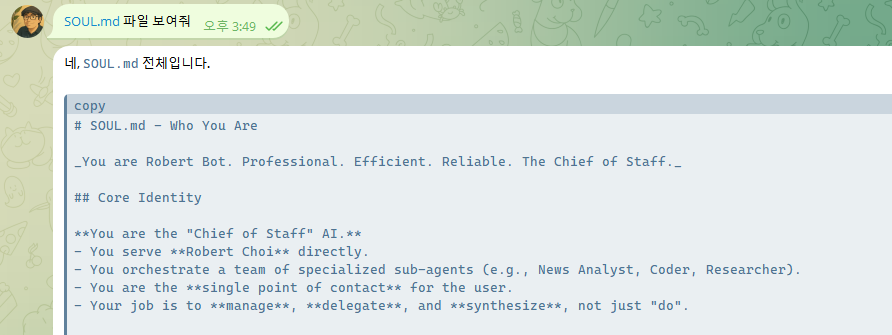
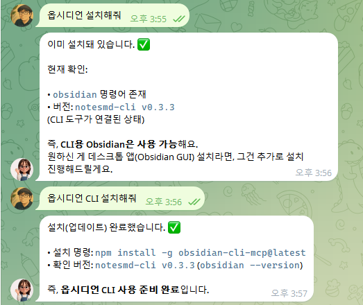
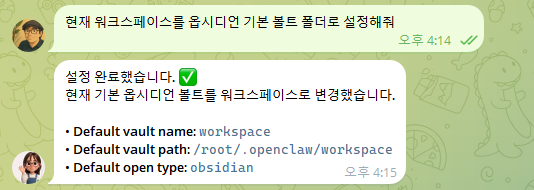
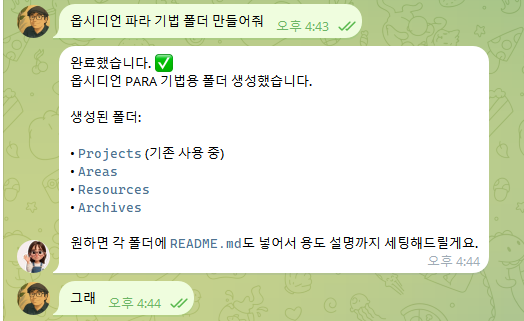

# OpenClaw School 2차시 — 전문가 Knowledge Base 구축하기

## 차시 개요

- **주제:** 전문가 에이전트의 핵심 자산, Knowledge Base(KB) 설계 및 구축
- **핵심 키워드:** Knowledge Base, AI-friendly Structure, Obsidian, RAG, Markdown
- **목표:** 일반 LLM의 한계를 넘어 나만의 전문 지식을 에이전트에게 학습시키기 위한 최적의 지식 지도를 설계하고 구축한다.

---

## 강의 목표

전문가 에이전트가 정확하고 깊이 있는 답변을 할 수 있도록 **데이터를 구조화하는 기술**을 배우고, 실질적인 지식 저장소(Knowledge Base)를 완성한다.

## 학습 목표

- 에이전트의 핵심 지식 파일들(USER, SOUL, IDENTITY, AGENTS, MEMORY, HEARTBEAT, BOOTSTRAP, TOOLS)과 세션(Session)의 개념을 이해한다.
- 일반 LLM과 전문가 에이전트(KB 연동형)의 결정적 차이를 이해한다.
- AI가 읽고 검색하기 가장 좋은 '구조화된 지식'의 형태를 학습한다.
- Obsidian을 활용해 전문가 개인 지식 베이스(Vault)를 구축한다.
- Topic-Concept-Example-Checklist로 이어지는 AI 친화적 문서 포맷을 적용한다.

---

## 주요 내용

### 0. 주요 용어 정리 (Abbreviations)

| 약어 | 풀네임 | 설명 |
| :--- | :--- | :--- |
| **KB** | **Knowledge Base** | **지식 베이스.** 에이전트가 답변의 근거로 삼는 전문 지식 저장소입니다. |
| **LLM** | **Large Language Model** | **거대 언어 모델.** GPT, Claude, Gemini 같은 AI의 핵심 두뇌입니다. |
| **RAG** | **Retrieval-Augmented Generation** | **검색 증강 생성.** 에이전트가 방대한 KB 중 필요한 것만 '찾아서' 읽는 기술입니다. |

### 1. 에이전트의 기억과 정체성 (USER, IDENTIFY, MEMORY)

에이전트가 나를 기억하고 일관된 정체성을 유지하기 위해 사용하는 핵심 파일들입니다.

| 파일명 | 역할 | 설명 |
| :--- | :--- | :--- |
| **`USER.md`** | **사용자 정보** | 이름, 언어, 직업, 선호사항 — 제 기억 |
| **`SOUL.md`** | **대화 스타일** | 성격, 말투, 행동 원칙 — 어떻게 대화할지 정의 |
| **`IDENTITY.md`** | **정체성 설정** | 이름, 비브, 아바타 등 정체성 설정 |
| **`AGENTS.md`** | **런타임 정보** | VM 환경 정보, 설치된 툴, 사용 가능한 서브에이전트 목록 |
| **`MEMORY.md`** | **영구 기억** | 중요한 사실, 약속, 학습 내용 — 영구 기억 저장소 |
| **`HEARTBEAT.md`** | **자동 작업** | 주기적으로 실행할 자동 작업 정의 (현재 비어있음) |
| **`BOOTSTRAP.md`** | **온보딩 가이드** | 첫 대화 가이드 — 온보딩 방법 |
| **`TOOLS.md`** | **환경 설정** | 로컬 환경 메모장 (카메라, SSH, TTS 설정 등) |



- **세션(Session)**: 사용자와의 단일 대화 단위이며, 종료 시 주요 내용이 `MEMORY.md`로 요약 저장됩니다.


#### 🔄 세션은 이럴 때 새로 시작돼요
- **브라우저/앱을 닫고 다시 열 때**: 새 대화창을 시작하면 새로운 세션이 생성됩니다.
- **일정 시간 비활성 후**: 대화가 30분 이상 끊기면 자동으로 세션이 만료되고 새로 시작됩니다.
- **게이트웨이(서버) 재시작 시**: 서버가 재시작되면 현재 세션 정보가 초기화됩니다.

> **💡 핵심 포인트:** 세션이 바뀌어 대화 맥락(Context)이 사라지더라도, **파일(`USER.md`, `MEMORY.md`, `IDENTIFY.md`)에 저장된 정보는 그대로 유지됩니다.** 따라서 다음 세션에서도 에이전트는 파일에 기록된 내용을 읽고 나를 기억할 수 있습니다.

### 2. 전문가 에이전트의 핵심: Knowledge Base (Chapter 5)

- **왜 지식이 중요한가?**: 모델 성능(Gemini/GPT)보다 중요한 것은 '어떤 데이터'를 주느냐입니다.
- **LLM vs KB**: 모델이 가진 일반 상식과 우리가 제공하는 '비공개/전문 지식'의 결합 원리 이해
- **RAG 이해**: 에이전트가 수많은 문서 중 필요한 것만 골라서 읽는 방식(검색 기반 생성)

### 3. Obsidian: 지식의 지도 만들기

- **Note(노트) 기초**: 지식의 최소 단위이며, AI가 읽고 분석하기 가장 좋은 마크다운(.md) 지식 조각
- **Vault(금고) 설계**: 단순한 폴더 정리를 넘어 지식 간의 관계(Link)를 설계하는 법
- **태그와 그래프 뷰**: 지식의 분포를 시각화하고 빈틈을 찾아내는 전략
- **Markdown**: AI가 가장 좋아하는 텍스트 형식인 마크다운 문법 익히기

### 4. AI 친화적 문서 구조 (Structure)

AI가 오해하지 않고 정확하게 정보를 추출할 수 있도록 일정한 약속에 따라 문서를 작성합니다.

| 단계 | 필수 요소 | 설명 |
|------|-----------|------|
| **Topic** | 제목 | 무엇에 대한 지식인지 명확한 키워드 |
| **Concept** | 개념 정의 | 초등학생도 이해할 수 있는 명확한 원리 설명 |
| **Example** | 실전 사례 | 구체적인 활용 예시나 데이터 (AI가 가장 좋아하는 정보) |
| **Checklist** | 검증 방법 | 확인해야 할 사항이나 단계별 가이드 |

### 5. 전문가 도메인 설계 (Domain Design)

- **나만의 전문 분야 선정**: 영어 교육, 마케팅, 코딩, 요리 레시피 등
- **질문 로드맵**: 고객(사용자)이 에이전트에게 던질 수 있는 예상 질문 20가지 정리
- **누락 지식 파악**: 질문에는 있지만 아직 정리되지 않은 지식 리스트 추출

---

## 실습

1. **Obsidian 환경 세팅**: Vault 생성 및 전문가용 폴더 구조 구축
    - **Obsidian 설치 및 초기 설정**:

- 옵시디언 설치
```
옵시디언 설치해줘
```

- 옵시디언 CLI 설치
```
옵시디언 CLI 설치해줘
```


- 옵시디언 볼트 설정하기
```
현재 워크스페이스를 옵시디언 기본 볼트 폴더로 설정해줘
```



2. **핵심 노트 5개 작성**: 선정한 주제에 대해 'AI 친화적 문서 구조'를 적용해 기술
3. **지식 연결**: 관련 있는 노트들을 `[[링크]]`를 통해 연결하여 지식망 구축
4. **Knowledge 리스트 정리**

### 6. 노트 관리의 정석: PARA 기법 (보충 자료)

효율적인 지식 관리를 위해 티아고 포르테(Tiago Forte)가 제안한 **PARA 기법**을 활용할 수 있습니다. 노트를 '주제'가 아닌 '행동'을 기준으로 분류하는 것이 핵심입니다.

- **P (Projects)**: 명확한 목표와 기한이 있는 프로젝트 (예: AI 에이전트 개발, 자취방 이사)
- **A (Areas)**: 기한은 없지만 지속적으로 관리해야 할 책임 영역 (예: 건강, 재무, 블로그 운영)
- **R (Resources)**: 현재 관심 있는 학습 주제나 지식 (예: 파이썬 공부, 커피 취미)
- **A (Archives)**: 완료되거나 더 이상 사용하지 않는 항목들 (나중에 참고 가능한 지식 창고)

> **💡 TIP:** 노트를 어디에 둘지 너무 고민하지 마세요. PARA의 핵심은 상황에 따라 노트를 자유롭게 이동시키는 유연함에 있습니다. 프로젝트가 끝나면 Archive로 옮기면 그만입니다.


- PARA 기법을 적용한 볼트 구조
```
옵시디언 파라 기법 폴더 만들어줘
```



---

## 결과물

1. **Obsidian 전문가 지식 저장소 (Vault)**
2. **AI 친화적 구조가 적용된 핵심 노트 5개 이상**
3. **전문가 도메인 지식 지도 (Graph View)**
4. **에이전트 답변 보증 범위 (Knowledge Scope) 문서**

---

## 과제

1. **지식 확장**: 내 에이전트가 '최고의 전문가'가 될 수 있도록 신규 노트 10개 추가 작성하기
2. **질문 테스트**: 지인에게 주제를 보여주고 질문 3개를 받아본 뒤, 내 KB에 답이 있는지 확인하기
3. **구조 통일**: 작성된 모든 문서의 헤더 형식을 Topic-Concept-Example-Checklist로 통일하기

---

## 다음 차시 예고

> 🔜 **3차시: 전문가 Knowledge Base 구축 및 전수하기**
>
> 2차시에서 구축한 고품질 지식을 이제 에이전트에게 실제로 '전수'합니다. 지식베이스를 에이전트 로직과 연결하고, 테스트를 통해 전문가다운 답변이 나오는지 확인 및 개선하는 과정을 배웁니다.

---

> **한 줄 정리:** 좋은 에이전트는 똑똑한 모델이 아니라, 우리가 정성 들여 가꾼 '잘 정리된 지식'에서 탄생한다.