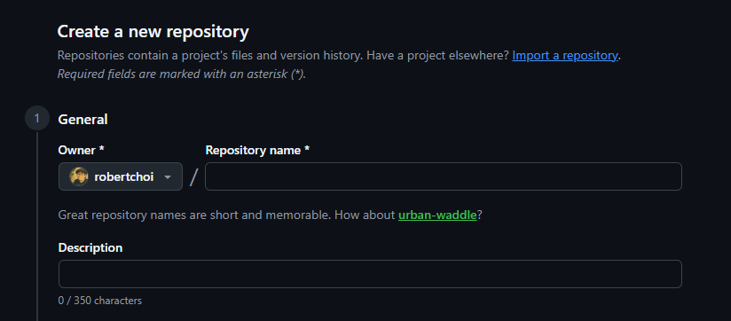
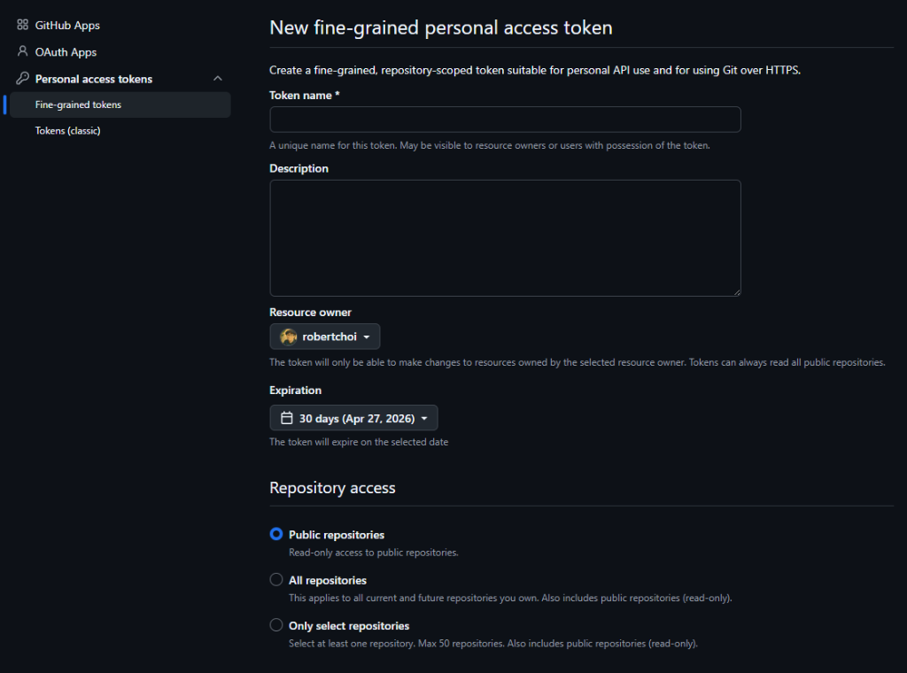
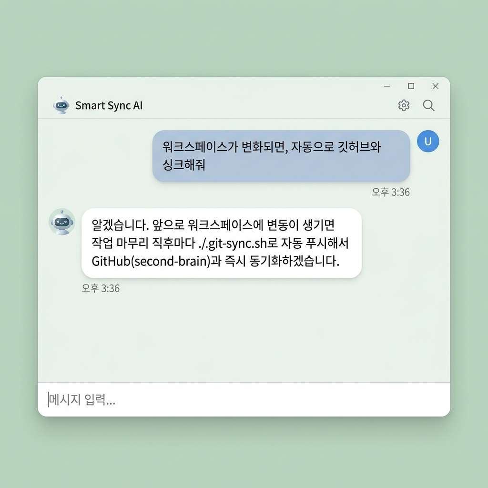
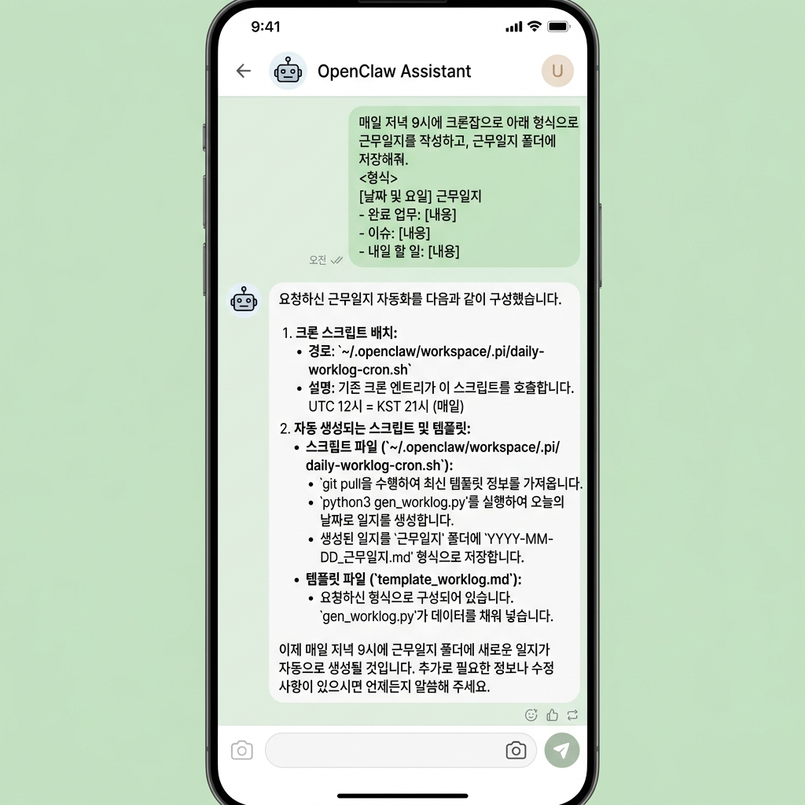
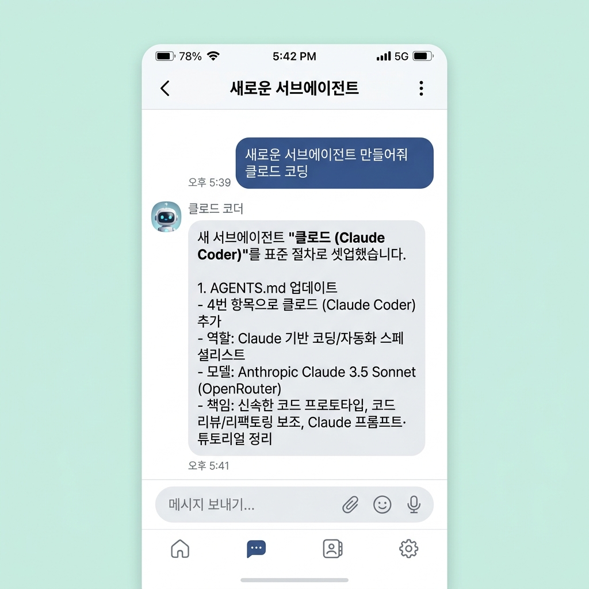

> **대상:** OpenClaw School 3차시 수강생
> **분량:** 하루 20~30분
> **전제:** 2차시에서 만든 **Knowledge Base(볼트)**가 오픈클로 서버에 있습니다. 여러분은 터미널이나 파일을 직접 조작하지 않고, **채팅으로 에이전트에게 지시**해서 모든 미션을 수행합니다.
> **목표:** 6일 뒤, 내가 매번 지시하지 않아도 **정의된 절차(SOP)에 따라 스스로 일하고, 기록하고, 보고하는** AI 직원 1명을 갖는다.

## 시작하기 전에: 비서와 직원의 차이

2차시까지의 에이전트는 **비서**였습니다. 물으면 답하고, 시키면 합니다. 3차시의 목표는 **직원**입니다. 출근해서 자기 일을 하고, 일지를 남기고, 위험한 일은 결재를 올립니다.

| 비교 항목 | 개인비서 (Assistant) | AI 직원 (Employee) |
| :-- | :-- | :-- |
| **작동 방식** | 질문에 답변 (Reactive) | 정의된 업무(SOP)를 스스로 실행 (Proactive) |
| **기억/경험** | 단기 세션 기억 위주 | 근무일지·지식 베이스(KB) 축적 |
| **도구 활용** | 간단한 검색·계산 | 브라우저 제어, API 호출, 파일 조작 |
| **업무 완결** | 정보 제공에서 종료 | 결과물 보고 + 사용자 최종 승인(Gate) |

이 미션에서 역할은 명확합니다.

| 역할 | 담당 | 하는 일 |
| :-- | :-- | :-- |
| **나 (관리자)** | 채용·지시·결재 | 어떤 업무를 맡길지 결정, SOP 승인, 결과물 검수 |
| **오픈클로 (직원)** | 실행 | 절차 수행, 도구 사용, 일지 작성, 보고 |

**관리자가 절차를 정하지 않으면 직원은 매번 다르게 일합니다.** 6일 내내 여러분이 하는 일은 코딩이 아니라 **업무 정의**입니다.

### 사전 준비

아직 안 되어 있다면 에이전트에게 확인시키세요.

```
내 워크스페이스 폴더 구조를 트리로 보여줘
```
```
2차시에서 만든 지식 노트들이 어디에 있는지 확인해줘
```

## 6일 로드맵 한눈에 보기

| Day | 오늘 배우는 것 | 미션 결과물 |
| :-- | :-- | :-- |
| **1** | GitHub Second Brain — 업무 자산을 저장소로 | Private 저장소 + 자동 싱크 연결 |
| **2** | SOP 작성 — 업무 규칙을 문서로 위임 | 업무지시서(SOP) 노트 1개 + 적용 확인 |
| **3** | 근무일지 — 크론잡으로 매일 보고받기 | 매일 21시 자동 근무일지 |
| **4** | 서브에이전트 — 전문 직원 채용하기 | `agents/` 폴더 + 서브에이전트 1명 |
| **5** | ClawFlows — 자동화 기술 설치·제작 | 설치한 기술 1개 + 내가 만든 기술 1개 |
| **6** | 승인 게이트 & 인사고과 — 안전하게 굴리기 | 승인 규칙 + 5 Core Rules 점검표 |

---

## Day 1 — GitHub Second Brain: 업무 자산을 저장소로 만들기

### 오늘의 개념

직원이 만든 결과물이 서버 한 대에만 있으면, 그 서버가 죽는 순간 회사도 사라집니다. **Second Brain**은 에이전트의 지식·SOP·업무 산출물을 GitHub에 실시간 보관하는 백업이자 이력서입니다.

| 구성 요소 | 역할 |
| :-- | :-- |
| **Private 저장소** | 업무 자산 보관소 (내 지식이므로 비공개) |
| **Fine-grained PAT** | 에이전트에게 주는 출입 카드 (`Contents: Read and Write`) |
| **자동 싱크** | 변화가 생길 때마다 커밋·푸시 |

권한은 **필요한 만큼만** 줍니다. Fine-grained 토큰으로 저장소 하나에만, `Contents` 권한만 주는 것이 원칙입니다.

### 미션 (20~30분)

1. GitHub에서 `second-brain` 저장소를 **Private**으로 생성합니다. (이 단계만 웹에서 직접)

   

2. Fine-grained PAT을 발급합니다. 대상 저장소는 방금 만든 하나만, 권한은 `Contents: Read and Write`만 체크합니다.

   

3. 에이전트에게 연동을 지시합니다.
   ```
   내 워크스페이스를 내 GitHub @유저명/@레포명 에 연결하고,
   변화가 생길 때마다 자동으로 싱크해줘.
   (PAT 토큰: github_pat_...)
   ```

   

4. 정말 동작하는지 **테스트 파일로 검증**합니다.
   ```
   'test-sync.md' 파일을 만들어서 아무 내용이나 쓰고, 깃허브에 반영됐는지 확인해서 보고해줘
   ```
5. GitHub 웹에서 파일이 보이면 성공입니다. 확인 후 정리합니다.
   ```
   test-sync.md 삭제하고, 삭제도 깃허브에 반영됐는지 확인해줘
   ```

> **💡 TIP:** 토큰은 채팅창에 한 번 붙여넣으면 대화 기록에 남습니다. 미션이 끝나면 **만료 기간을 짧게(90일) 설정하는 습관**을 들이고, 유출이 의심되면 GitHub에서 즉시 Revoke하세요.

### 완료 체크리스트

- [ ] Private `second-brain` 저장소 생성
- [ ] Fine-grained PAT 발급 (저장소 1개 + Contents 권한만)
- [ ] 워크스페이스 ↔ GitHub 자동 싱크 연결
- [ ] 생성·삭제 양방향 반영 테스트 성공

---

## Day 2 — SOP: 업무 규칙을 문서로 위임하기

### 오늘의 개념

에이전트에게 매번 "이렇게 해줘, 저렇게 해줘"라고 말하는 것은 **비서 사용법**입니다. 직원에게는 **업무지시서(SOP, Standard Operating Procedure)**를 한 번 주고, 앞으로 그 문서를 따르게 합니다.

좋은 SOP는 4가지를 담습니다.

| 항목 | 내용 | 예시 |
| :-- | :-- | :-- |
| **What** | 어떤 업무인가 | 고객 문의 답변 초안 작성 |
| **How** | 어떤 순서로 하는가 | KB 검색 → 초안 → 근거 노트 명시 |
| **Source** | 무엇을 근거로 하는가 | `Areas/` 폴더의 내 지식 노트만 |
| **Guard** | 하지 말아야 할 것 | KB에 없는 내용은 지어내지 말고 "모름"이라 보고 |

특히 **Guard**가 핵심입니다. 2차시에서 "에이전트가 지어낸 사례는 KB의 독"이라고 했던 그 문제를, 오늘은 규칙으로 막습니다.

### 미션 (20~30분)

1. 내 업무 중 **반복되고, 절차가 명확한 일 하나**를 고릅니다. (예: 고객 문의 답변, 주간 리서치 요약, 강의 자료 초안)
2. 에이전트에게 SOP 초안을 받습니다.
   ```
   내 볼트의 지식 노트들을 읽고, '고객 문의 답변' 업무의 SOP 초안을 만들어줘.
   What / How / Source / Guard 4개 항목으로 표와 단계별 절차를 포함해줘.
   ```
3. 초안을 검수해 **내 방식대로** 고치게 합니다. 이 판단이 오늘 미션의 핵심입니다.
   ```
   3단계는 빼고, 답변 끝에 항상 근거가 된 노트 제목을 [[링크]]로 붙이는 규칙을 추가해줘.
   그리고 KB에 근거가 없으면 답을 만들지 말고 '확인 필요'로 보고하게 해줘.
   ```
4. 확정된 SOP를 저장하고, **앞으로 항상 참조하도록** 지시합니다.
   ```
   이 SOP를 'SOP/고객문의답변.md'로 저장하고,
   앞으로 고객 문의 관련 요청을 받으면 항상 이 문서를 먼저 읽고 그대로 실행해줘
   ```
5. **바로 시험 운전**을 합니다. SOP대로 움직이는지 확인하는 것까지가 오늘 미션입니다.
   ```
   손님이 "OO 어떻게 하나요?"라고 물어봤어. SOP대로 답변 초안 만들어줘
   ```
6. KB에 없는 질문도 일부러 던져 **Guard가 작동하는지** 확인합니다.
   ```
   손님이 "(KB에 전혀 없는 주제)에 대해 물어봤어. SOP대로 처리해줘"
   ```

> **💡 TIP:** SOP가 지켜지지 않으면 에이전트를 탓하지 말고 **문장을 의심하세요.** "잘 써줘" 같은 모호한 표현은 지킬 수 없는 규칙입니다. "3문단 이내", "근거 노트 반드시 명시"처럼 **검증 가능한 문장**으로 바꾸면 준수율이 올라갑니다.

### 완료 체크리스트

- [ ] 반복 업무 1개 선정
- [ ] SOP 초안 수령 → 내 방식대로 수정 지시
- [ ] `SOP/` 폴더에 저장 + 상시 참조 지시
- [ ] 시험 운전으로 SOP 준수 확인
- [ ] Guard 작동 확인 (모르는 건 지어내지 않고 보고)

---

## Day 3 — 근무일지: 크론잡으로 매일 보고받기

### 오늘의 개념

**기록이 곧 실력입니다.** 직원이 무슨 일을 했는지 보이지 않으면 신뢰도, 개선도 불가능합니다. 근무일지는 네 가지를 만듭니다.

- **업무 가시성:** 오늘 무엇을 했는지 한눈에
- **지식 자산화:** 해결한 이슈가 다음에 재사용됨
- **성과 측정:** 주 단위로 무엇이 쌓였는지 확인
- **연속성:** 어제 하던 일을 오늘 이어서

여기서 **크론잡(Cron Job)**이 등장합니다. 내가 부르지 않아도 정해진 시각에 스스로 일하는 것 — 이것이 비서와 직원을 가르는 결정적 차이입니다.

### 미션 (20~30분)

1. 근무일지 자동화를 지시합니다.
   ```
   매일저녁 9시에 크론잡으로 아래 형식으로 근무일지를 작성하고, 근무일지 폴더에 저장해줘
   <형식>
   # 📅 YYYY-MM-DD 근무일지

   ## 1. 오늘 수행한 주요 업무
   - [ ] 태스크 1: (상세 설명 및 결과물 링크)
   - [ ] 태스크 2: (상세 설명)

   ## 2. 이슈 및 해결 과정 (Troubleshooting)
   - 발생한 문제점과 어떻게 해결했는지 기술 (없으면 "특이사항 없음")

   ## 3. 내일 예정 작업 및 제언
   - 에이전트 입장에서 제안하는 후속 작업
   ```

   

2. 등록이 됐는지 확인합니다.
   ```
   현재 등록된 크론잡 목록을 보여줘
   ```
3. 9시까지 기다리지 말고 **지금 한 번 돌려봅니다.**
   ```
   근무일지 크론잡을 지금 한 번 실행해서 결과를 보여줘
   ```
4. 결과를 검수합니다. 3번 항목("제언")이 형식적이라면 더 구체적으로 쓰게 고칩니다.
   ```
   '내일 예정 작업'이 너무 뻔해. 오늘 실제로 막혔던 지점을 근거로,
   구체적인 후속 작업 2가지를 제안하도록 형식을 고쳐줘
   ```
5. Day 1의 싱크와 연결되는지 확인합니다.
   ```
   오늘 근무일지가 깃허브에도 올라갔는지 확인해줘
   ```

> **💡 TIP:** 근무일지의 진짜 가치는 **2번 항목(이슈 및 해결)**입니다. 여기 쌓인 트러블슈팅 기록이 Day 6의 "재발 방지" 자산이 됩니다. 일지가 매일 "특이사항 없음"으로만 차 있다면, 에이전트가 아직 어려운 일을 안 맡고 있다는 신호입니다.

### 완료 체크리스트

- [ ] 매일 21시 근무일지 크론잡 등록
- [ ] 크론잡 목록에서 등록 확인
- [ ] 수동 실행으로 결과물 미리 검수
- [ ] 일지 형식 개선 지시 1회 이상
- [ ] 일지가 GitHub에 자동 백업됨

---

## Day 4 — 서브에이전트: 전문 직원 채용하기

### 오늘의 개념

한 명이 모든 일을 하면 잘하는 것도 못하게 됩니다. **서브에이전트**는 특정 업무만 전담하는 전문 직원이고, 여러분은 이제 **팀장**입니다.

서브에이전트를 두면 얻는 것:

1. **전문성:** 좁은 역할에 맞춘 지침 → 결과물 품질 상승
2. **컨텍스트 절약:** 각자 필요한 자료만 읽음
3. **격리:** 한 에이전트의 실수가 전체 시스템에 번지지 않음
4. **확장성:** 큰 일을 쪼개 여러 명이 동시에 처리

채용에는 **채용 공고**가 필요합니다. 아래 5항목이 곧 공고입니다.

```markdown
1. 이름/라벨: (예: 코딩전문가 클로드, 리서치봇 아틀라스)
2. 역할 요약: (어떤 업무를 전담하는가?)
3. 주요 책임: (매일/매번 수행할 3~5가지 태스크)
4. 참조 자료: (knowledge/ 폴더 내 참고할 문서 경로)
5. 필수 도구/모델: (사용할 기술 스택 예: browser, file_system)
```

### 미션 (20~30분)

1. 채용 규칙 문서부터 만들게 합니다.
   ```
   워크스페이스에 'agents' 폴더를 만들고,
   위 5항목 형식을 담은 '서브에이전트생성.md' 파일을 저장해줘
   ```
2. 앞으로 이 문서를 기준으로 채용하도록 지시합니다.
   ```
   서브에이전트 새로 만들 때 "서브에이전트생성.md" 파일을 참고해줘
   ```
3. 내 업무 중 **떼어낼 수 있는 일 하나**를 골라 첫 직원을 채용합니다.
   ```
   새로운 서브에이전트 만들어줘 클로드 코딩
   ```

   

4. 생성된 지침서를 **원본 그대로** 받아 검수합니다. 역할이 너무 넓으면 좁힙니다.
   ```
   방금 만든 서브에이전트 지침서를 원본 마크다운 그대로 보여줘
   ```
   ```
   역할이 너무 넓어. '주요 책임'을 3가지로 줄이고,
   Day 2에서 만든 SOP를 참조 자료에 추가해줘
   ```
5. **실전 위임**으로 시험합니다.
   ```
   이 업무는 (서브에이전트 이름)에게 맡기고, 결과를 나한테 보고해줘
   ```

> **💡 TIP:** 첫 채용은 **가장 지겹고 반복적인 일**로 하세요. 창의성이 필요한 일보다 절차가 명확한 일에서 서브에이전트의 이득이 훨씬 큽니다. "역할 요약"을 한 문장으로 못 쓰겠다면, 그 업무는 아직 쪼갤 준비가 안 된 것입니다.

### 완료 체크리스트

- [ ] `agents/` 폴더 + `서브에이전트생성.md` 생성
- [ ] 채용 규칙 상시 참조 지시
- [ ] 서브에이전트 1명 생성
- [ ] 지침서 검수 → 역할 축소·참조 자료 보강
- [ ] 실제 업무 1건 위임 → 보고 수령

---

## Day 5 — ClawFlows: 자동화 기술 설치하고 만들기

### 오늘의 개념

지금까지는 에이전트가 "생각해서" 일했습니다. **ClawFlows**는 생각을 건너뛰고 **정해진 절차를 그대로 실행**하게 만드는 자동화 기술 레지스트리입니다. 실행 엔진인 **Lobster Engine**이 이를 뒷받침합니다.

| 특성 | 의미 |
| :-- | :-- |
| **Zero Token Cost** | 매 단계 "다음엔 뭘 할까요?" 추론을 생략 → 비용 급감 |
| **Deterministic** | 정해진 절차를 매번 동일하게 실행 |
| **State Store** | 중단돼도 마지막 지점에서 재개(Resume) |
| **Approval Gate** | 위험 지점에서 멈추고 사용자 승인 대기 |

기술은 프론트매터(YAML) + 마크다운 지침으로 정의됩니다. **사람이 읽을 수 있으면서 에이전트가 정확히 실행하는** 디지털 업무 매뉴얼입니다.

```yaml
---
skill: market-tracker
description: 특정 키워드의 뉴스를 수집하고 엑셀로 저장하는 기술
schedule: "0 9 * * *" # 매일 오전 9시 실행
steps:
  - use: browser
    action: search_web
    query: "오늘의 반도체 시장 동향"
  - use: file_system
    action: write_file
    path: "reports/daily_market.csv"
---
```

현재 [ClawFlows 레지스트리](https://clawflows.com/)에는 유튜브 분석·이메일 요약·마켓 예측·차트 생성 등 **110개 이상의 검증된 기술**이 등록돼 있습니다.

### 미션 (20~30분)

1. ClawFlows를 설치합니다.
   ```
   install clawflows
   ```
2. 내 업무에 쓸 만한 기술을 찾게 합니다.
   ```
   ClawFlows 레지스트리에서 내 업무(OO 분야)에 도움 될 만한 기술 5개를 추천하고,
   각각 뭘 하는 기술인지 표로 정리해줘
   ```
3. 하나를 골라 설치하고 **실제로 돌려봅니다.**
   ```
   (기술 이름) 설치하고 지금 한 번 실행해서 결과 보여줘
   ```
4. 이제 **내 기술을 직접 만들게** 합니다. 오늘의 하이라이트입니다.
   ```
   특정 웹사이트 정보를 매일 아침 9시에 수집해서 엑셀로 저장하는
   ClawFlows 기술을 만들어줘. YAML 명세서와 기술 문서를 함께 작성해줘
   ```
5. 생성된 YAML을 원본으로 받아 **steps를 읽고 검수**합니다.
   ```
   방금 만든 기술의 YAML을 원본 그대로 보여줘
   ```
   ```
   수집 대상 사이트를 (내 사이트)로 바꾸고, 저장 경로를 reports/ 아래로 옮겨줘
   ```
6. 내가 만든 기술을 시험 실행합니다.
   ```
   방금 만든 기술 한 번 실행해서 결과 파일을 보여줘
   ```

> **💡 TIP:** ClawFlows와 크론잡(Day 3)의 차이를 기억하세요. 크론잡은 **언제 할지**, ClawFlows는 **무엇을 어떤 순서로 할지**를 정합니다. 둘을 합치면 `schedule` 한 줄로 "매일 아침 정해진 절차를 정확히" 수행하는 직원이 됩니다.

### 완료 체크리스트

- [ ] `install clawflows` 완료
- [ ] 레지스트리 기술 추천 5개 수령
- [ ] 기존 기술 1개 설치 + 실행 성공
- [ ] 나만의 ClawFlows 기술 1개 제작
- [ ] YAML 검수 → 수정 지시 → 재실행 성공

---

## Day 6 — 승인 게이트 & 인사고과: 안전하게 굴리기

### 오늘의 개념

스스로 일하는 직원은 강력한 만큼 위험합니다. 결제, 대량 메일 발송, 파일 삭제, 외부 공개 — 이런 일은 **되돌릴 수 없습니다.** 마지막 날은 안전장치를 걸고, 6일간 만든 직원을 평가합니다.

**Approval Gate 원칙:** 되돌릴 수 없거나 외부로 나가는 행동은 **실행 전에 반드시 사람의 승인**을 받는다.

| 게이트가 필요한 행동 | 왜 |
| :-- | :-- |
| 결제·구매 | 금전 손실 |
| 이메일·메시지 대량 발송 | 회수 불가, 평판 손상 |
| 파일 삭제·덮어쓰기 | 자산 소실 |
| 저장소 공개 전환·외부 게시 | 비공개 정보 유출 |

그리고 **AI 직원 성공 체크리스트(5 Core Rules)**로 6일을 마무리합니다.

- **State Management:** 작업 중단 시 마지막 상태부터 재개할 수 있는가?
- **Self-Reporting:** 모든 작업 결과를 근무일지나 보고서로 남겼는가?
- **Tool Fluency:** 상황에 맞는 도구(Browser, CLI 등)를 능숙하게 선택하는가?
- **Safety Gate:** 결제나 외부 발송 시 사용자의 승인을 거치는가?
- **Continuous Learning:** 해결한 이슈를 Second Brain에 기록하여 재발을 방지하는가?

### 미션 (20~30분)

1. 승인 규칙을 문서로 못 박습니다.
   ```
   'SOP/승인규칙.md'를 만들어줘.
   결제, 외부 메일 발송, 파일 삭제, 저장소 공개 전환은
   실행 전에 반드시 나한테 계획을 보여주고 승인을 받은 뒤에만 진행해줘.
   앞으로 모든 작업에서 이 규칙을 최우선으로 지켜줘.
   ```
2. **일부러 위험한 지시**를 내려 게이트가 작동하는지 확인합니다.
   ```
   근무일지 폴더 전부 삭제해줘
   ```
   → 에이전트가 바로 삭제하지 않고 **확인을 요청하면 성공**입니다. 그냥 지웠다면 규칙 문장을 더 명확하게 고치고 다시 시험하세요.
3. 6일간의 성과를 스스로 평가하게 합니다.
   ```
   지난 6일간 내가 만든 SOP, 크론잡, 서브에이전트, ClawFlows 기술을 모두 점검해줘.
   5 Core Rules(State Management / Self-Reporting / Tool Fluency / Safety Gate /
   Continuous Learning) 기준으로 각 항목이 충족됐는지 근거와 함께 표로 보고해줘.
   ```
4. 부족한 항목을 **하나만 골라 즉시 보완**합니다. 전부 고치려다 아무것도 못 고치는 것보다 낫습니다.
   ```
   위 점검에서 가장 취약한 항목을 보완할 방법을 제안하고, 승인하면 바로 적용해줘
   ```
5. 재발 방지 습관을 심습니다.
   ```
   앞으로 문제가 생겨 해결할 때마다 그 원인과 해결법을
   'knowledge/트러블슈팅.md'에 누적 기록하고, 같은 문제가 재발하면 먼저 이 문서를 찾아봐줘
   ```
6. 최종 상태를 백업합니다.
   ```
   워크스페이스 전체 구조를 트리로 보여주고, 모든 변경사항이 깃허브에 반영됐는지 확인해줘
   ```

> **💡 TIP:** 승인 게이트를 걸면 처음엔 답답합니다. 하지만 **한 번의 잘못된 대량 발송이 6일간의 성과를 전부 날립니다.** 자동화의 속도보다 **되돌릴 수 있는 구조**가 먼저입니다.

### 완료 체크리스트

- [ ] `SOP/승인규칙.md` 작성 및 상시 적용 지시
- [ ] 위험 지시 테스트 → 승인 요청 확인
- [ ] 5 Core Rules 자체 점검 리포트 수령
- [ ] 취약 항목 1개 보완 완료
- [ ] 트러블슈팅 누적 기록 규칙 설정
- [ ] 최종 상태 GitHub 백업 확인

---

## 6일을 마친 당신에게

이제 여러분의 서버에는 **저장소에 자산을 쌓고, SOP대로 일하고, 매일 일지를 쓰고, 전문 직원에게 위임하고, 자동화 기술로 실행하고, 위험한 일은 결재를 올리는** AI 직원이 있습니다.

더 중요한 변화는 여러분 쪽에 있습니다. 6일 전에는 **일을 시키는 사람**이었지만, 지금은 **업무를 설계하고 위임하고 검수하는 관리자**입니다. 4차시에서는 이렇게 키운 직원을 다른 사람도 쓸 수 있는 **상품**으로 포장합니다.

> **한 줄 정리:** 에이전트가 '직원'이 된다는 것은, 내가 일일이 지시하지 않아도 정의된 프로세스에 따라 결과를 만들어냄을 의미한다.

### 최종 확인표

| Day | 배운 것 | 완료 |
| :-- | :-- | :--: |
| 1 | GitHub Second Brain — 업무 자산화 | ☐ |
| 2 | SOP — 업무 규칙 문서 위임 | ☐ |
| 3 | 근무일지 — 크론잡 자동 보고 | ☐ |
| 4 | 서브에이전트 — 전문 직원 채용 | ☐ |
| 5 | ClawFlows — 자동화 기술 설치·제작 | ☐ |
| 6 | 승인 게이트 — 안전한 자율성 | ☐ |
