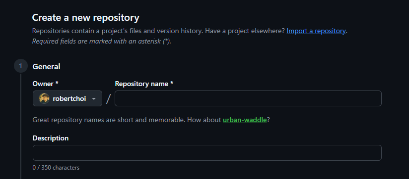
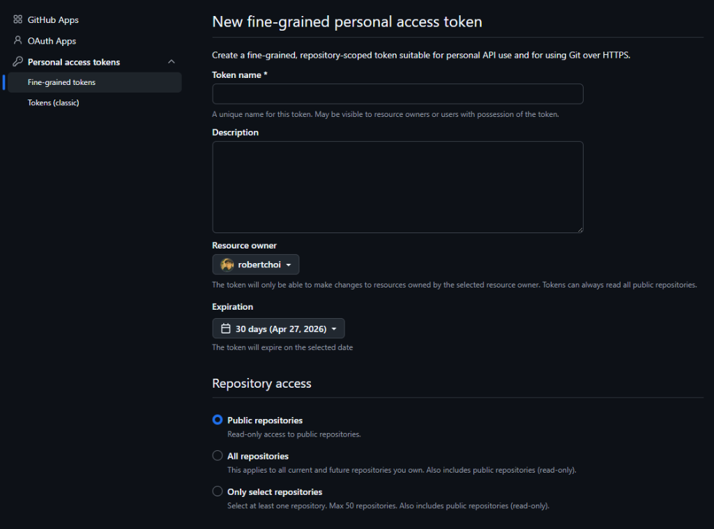
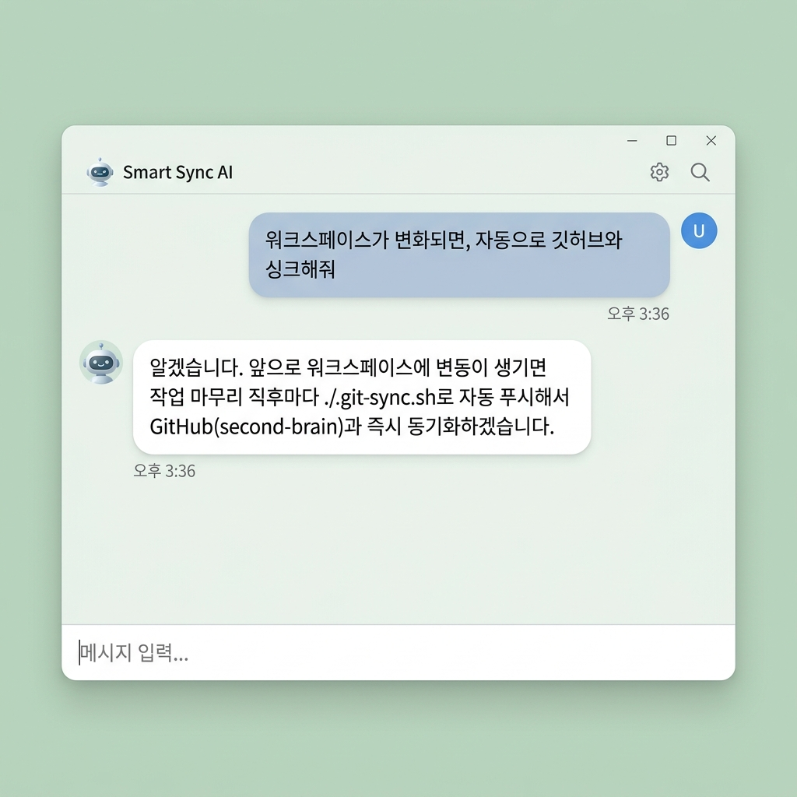
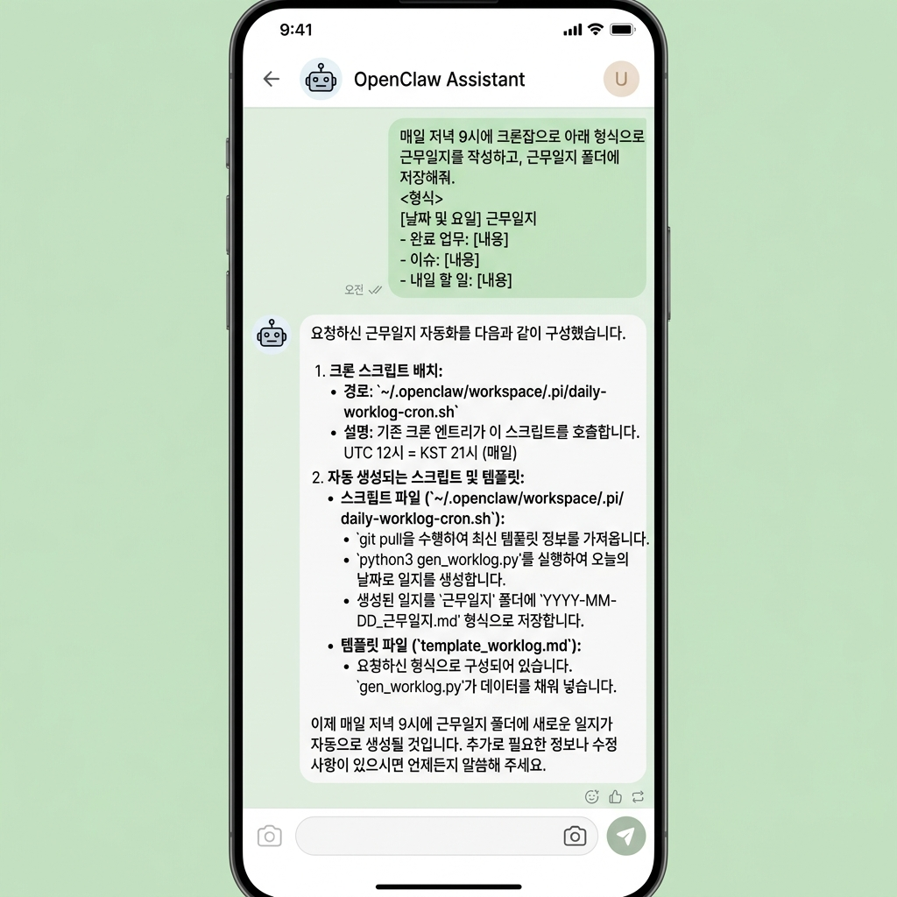
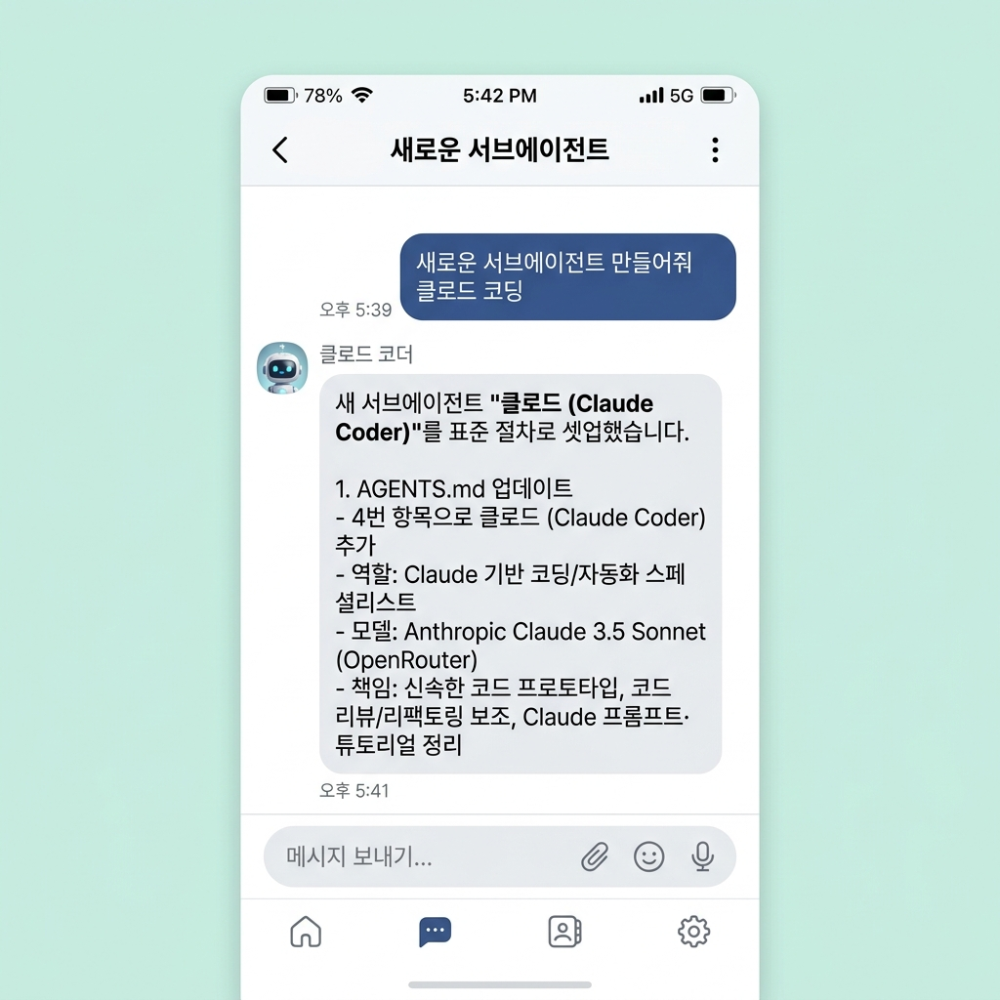

# 📂 OpenClaw School 3차시 — 개인비서에서 직원으로 전환하기

## 01. 차시 개요

- **주제:** 단순 보조를 넘어 스스로 판단하고 실행하는 'AI 직원' 만들기
- **핵심 키워드:** SOP(Standard Operating Procedure), Tool Use, Proactive Action, Autonomy
- **목표:** "지시를 기다리는 비서"에서 "워크플로우를 완수하는 직원"으로 역량 격상

---

## 02. 학습 목표

> 단순한 질문 답변 수준을 넘어, 정의된 업무 절차(SOP)에 따라 도구를 활용해 독립적인 결과물을 만들어내는 **AI 실무자**를 기획하고 구현합니다.

*   **비서(Assistant) vs 직원(Employee):** 수동적 응답과 능동적 실행의 구조적 차이 이해
*   **업무 자산화:** GitHub를 활용한 'Second Brain' 저장소 구축 및 동기화
*   **업무 규칙(SOP) 설계:** 마크다운 기반의 지시서(Instruction)를 에이전트에게 주입하는 법 습득
*   **멀티 에이전트 시스템:** 특정 전문 업무를 수행하는 서브에이전트(Sub-agent) 위임 및 협업 설계

---

## 03. 주요 내용

### 📋 Assistant vs Employee: 무엇이 다른가?

| 비교 항목 | 개인비서 (Assistant) | AI 직원 (Employee) |
| :--- | :--- | :--- |
| **작동 방식** | 사용자의 질문에 답변 (Reactive) | 정의된 업무(SOP)를 스스로 실행 (Proactive) |
| **기억/경험** | 단기 세션 기억 위주 | 근무일지 및 지식 베이스(KB) 축적 |
| **도구 활용** | 간단한 검색 및 계산 | 브라우저 제어, API 호출, 파일 시스템 조작 |
| **업무 완결** | 정보 제공에서 종료 | 결과물 보고 및 사용자 최종 승인(Gate) 대기 |

---

### 1️⃣ 업무 자산 관리: GitHub Second Brain 구축

AI 직원이 사용할 지식과 SOP를 안전하게 보관하고 어디서든 동기화할 수 있도록 GitHub 저장소를 구축합니다.

1.  **Repository 생성:** GitHub에서 `second-brain` 저장소를 생성합니다. (보안을 위해 **Private** 권한 권장)




2.  **Fine-grained PAT 발급:** 에이전트가 `Contents: Read and Write` 권한을 가질 수 있도록 전용 토큰을 발급합니다.




3.  **Workspace 연동:** 터미널에서 아래 명령어로 에이전트와 GitHub 간의 자동 싱크를 명령합니다.

```powershell
~/.openclaw/workspace 폴더를 내 GitHub @유저명/@레포명 에 연결하고, 변화가 생길 때마다 자동으로 싱크해줘.
(PAT 토큰: github_pat_...)
```



---

### 2️⃣ 근무일지 만들기: "기록이 곧 실력이다"

근무일지는 에이전트의 업무 과정을 투명하게 공개하고 신뢰를 쌓는 핵심 장치입니다.

*   **💡 핵심 가치:** 업무 가시성 확보, 지식 자산화, 성과 측정, 연속성 유지
*   **자동화 지시:** 매일 밤 9시에 아래 템플릿으로 보고서를 작성하게 설정합니다.

```markdown
매일저녁 9시에 크론잡으로 아래 형식으로 근무일지를 작성하고, 근무일지 폴더에 저장해줘
<형식>
# 📅 YYYY-MM-DD 근무일지

## 1. 오늘 수행한 주요 업무
- [ ] 태스크 1: (상세 설명 및 결과물 링크)
- [ ] 태스크 2: (상세 설명)

## 2. 이슈 및 해결 과정 (Troubleshooting)
- 발생한 문제점과 어떻게 해결했는지 기술 (없으면 "특이사항 없음")

## 3. 내일 예정 작업 및 제언
- 에이전트 입장에서 제안하는 후속 작업

```



---

### 3️⃣ 서브에이전트 만들기: "유능한 팀장으로 거듭나기"

복잡한 일은 작게 쪼개어 **전문 서브에이전트**에게 맡깁니다. 이를 위해 명확한 '채용 공고(요청서)'가 필요합니다.

**[서브에이전트 생성 요청 템플릿]**
> 아래 형식을 복사하여 에이전트에게 전달하면 `agents/` 폴더에 새로운 직원이 생성됩니다.

```markdown
1. 이름/라벨: (예: 코딩전문가 클로드, 리서치봇 아틀라스)
2. 역할 요약: (어떤 업무를 전담하는가?)
3. 주요 책임: (매일/매번 수행할 3~5가지 태스크)
4. 참조 자료: (knowledge/ 폴더 내 참고할 문서 경로)
5. 필수 도구/모델: (사용할 기술 스택 예: browser, file_system)
```



---

### 4️⃣ ClawFlows & Lobster Engine: AI 직원의 '시스템화'

오픈클로의 심장인 **Lobster Engine**은 에이전트가 "운 좋게 잘하는 것"이 아니라 **"항상 일관되게 잘하는 시스템"**을 갖추게 합니다.

*   **ClawFlows:** 프론트매터(YAML)를 활용한 선언형 자동화 기술 레지스트리
*   **Zero Token Cost:** 추론(Reasoning) 단계를 줄여 실행 비용을 획기적으로 낮춤
*   **Deterministic Execution:** 정해진 절차를 100% 한 치의 오차 없이 실행

**[ClawFlows 기술 정의 예시 - 마켓 리서치]**
```yaml
---
skill: market-tracker
description: 특정 키워드의 뉴스를 수집하고 엑셀로 저장하는 기술
schedule: "0 9 * * *" # 매일 오전 9시 실행
steps:
  - use: browser
    action: search_web
    query: "오늘의 반도체 시장 동향"
  - use: file_system
    action: write_file
    path: "reports/daily_market.csv"
---
```

> [!TIP]
> **"나만의 자동화 기술 만들기"**: 에이전트에게 "특정 웹사이트 정보를 5분마다 추적해서 엑셀로 저장하는 ClawFlows 기술을 만들어줘"라고 요청해 보세요. 에이전트가 스스로 위와 같은 YAML 명세서를 작성합니다.

---

## 📈 AI 직원 성공 체크리스트 (5 Core Rules)

- [ ] **State Management:** 작업 중단 시 마지막 상태부터 재개할 수 있는가?
- [ ] **Self-Reporting:** 모든 작업 결과를 근무일지나 보고서로 남겼는가?
- [ ] **Tool Fluency:** 상황에 맞는 도구(Browser, CLI 등)를 능숙하게 선택하는가?
- [ ] **Safety Gate:** 결제나 외부 발송 시 사용자의 승인을 거치는가?
- [ ] **Continuous Learning:** 해결한 이슈를 Second Brain에 기록하여 재발을 방지하는가?

---


�전트 시스템에 영향을 주지 않도록 격리할 수 있으며, 독립적인 관리와 테스트가 가능해집니다.
4. **확장성 (Scalability)**: 복잡한 대규모 프로젝트를 수행할 때 업무를 작게 쪼개어 여러 서브에이전트가 동시에 처리하도록 설계할 수 있습니다.

### 🛠️ 어떻게 만드는가? (How)

워크스페이스에 "agents"폴더를 만들고, "서브에이전트생성.md"파일을 저장합니다.
```
서브에이전트 새로 만들떄 "서브에이전트생성.md"파일을 참고해줘
```

```
새로운 서브에이전트 만들어줘 클로드 코딩
```


## 🦞 ClawFlows & Lobster Engine: AI 직원의 '시스템화'

[ClawFlows.com](https://clawflows.com/)은 오픈클로 에이전트에게 단순한 대화를 넘어 **'업무 습관, 스케줄, 실행 규칙'**을 부여하는 자동화 레지스트리입니다. AI 직원이 '시스템'을 갖춘 전문가로 거듭나게 만드는 핵심 인프라입니다.

### 🤖 AI 직원은 어떻게 '유능한 사원'이 되는가? (AI Employee Metaphor)

대화만 잘하는 챗봇은 단순한 비서 수준에 머뭅니다. 하지만 **SOP(표준 업무 절차)**를 명확히 이해하고 실행하는 에이전트는 진정한 'AI 직원'이 됩니다.

- **사용자(Manager)**: 업무 지침(Instruction/YAML)을 정의하거나, [ClawFlows 레지스트리](https://clawflows.com/)에서 필요한 자동화 기술을 선택하여 지시합니다.
- **AI 에이전트(Agent)**: **Lobster Engine**이라는 강력한 도구를 손에 쥐고, 정의된 지침에 따라 한 치의 오차 없이 업무를 완수합니다.

### 📝 Instruction-based Automation (Markdown SOP)

ClawFlows는 프론트매터(YAML)와 마크다운 지침을 결합한 선언형 형식을 사용합니다. 이는 **'사람이 읽기 쉬우면서 에이전트가 완벽하게 실행할 수 있는'** 디지털 업무 매뉴얼입니다.

- **데이터 기반 의사결정**: "리서치 결과를 바탕으로 차트를 그려줘"와 같은 모호한 지시도, ClawFlows 기술을 가진 에이전트에게는 명확한 실행 단계(Step)로 변환됩니다.
- **업무의 이식성**: 잘 만들어진 워크플로우(SOP) 하나만 있으면, 어떤 에이전트에게든 동일한 업무 전문성을 즉시 부여할 수 있습니다.

### 🚀 Lobster Engine: 결정론적 실행과 비용 최적화

오픈클로의 실행 엔진인 **Lobster**는 대규모 언어 모델(LLM)의 불확실성을 제거하고 실행 안정성을 보장합니다.

1. **Zero Token Cost (비용 혁신)**: 매 단계마다 LLM에게 "다음엔 뭘 할까요?"라고 묻고 추론하는 과정을 생략합니다. 미리 정의된 **Typed Pipeline(JSON-first)**을 따라 실행함으로써 토큰 소모를 0에 가깝게 줄여 운영 비용을 혁신적으로 낮춥니다.
2. **결정론적 결과 (Deterministic)**: 실행 이력(Execution History)을 철저히 관리하여 중복 동작을 방지합니다. 파일 시스템 기반의 **State Store**를 통해 작업이 중단되더라도 마지막 시점에서 안전하게 재개(Resume)할 수 있습니다.
3. **Approval Gates (승인 시스템)**: 인프라 변경, 결제, 대량 이메일 발송 등 리스크가 있는 지점에서는 작업을 멈추고 **사용자의 최종 승인**을 기다리도록 설계되어 안전한 자동화가 가능합니다.

### 🧱 110+ 글로벌 자동화 레지스트리

현재 ClawFlows에는 유튜브 분석, 이메일 요약, 마켓 예측, 차트 생성 등 전 세계 개발자들이 공유하는 **110개 이상의 검증된 기술**이 등록되어 있습니다. 

터미널에서 단 한 줄의 명령어로 이 모든 전문성을 내 에이전트에게 주입해 보세요.

```bash
install clawflows
```

> [!TIP]
> **"나만의 자동화 기술 만들기"**: 에이전트에게 "특정 웹사이트 정보를 5분마다 추적해서 엑셀로 저장하는 ClawFlows 기술을 만들어줘"라고 요청해 보세요. 에이전트가 스스로 YAML 명세서와 기술 문서를 작성하여 깃허브에 반영(Publish)까지 제안할 것입니다.

---

## 과제

- 봇 가이드 문제 제작하기
---

## 다음 차시 예고

> 🔜 **4차시: 에이전트 비즈니스 및 상품화**
>
> 유능한 직원을 육성했다면, 이제 이 에이전트를 다른 사람들에게도 제공할 수 있는 **'상품'**으로 포장합니다. 패키징, 가격 정책, 그리고 마켓플레이스 등록을 통해 수익 창출의 단계로 나아갑니다.

---

> **한 줄 정리:** 에이전트가 '직원'이 된다는 것은, 내가 일일이 지시하지 않아도 정의된 프로세스에 따라 결과를 만들어냄을 의미한다.
